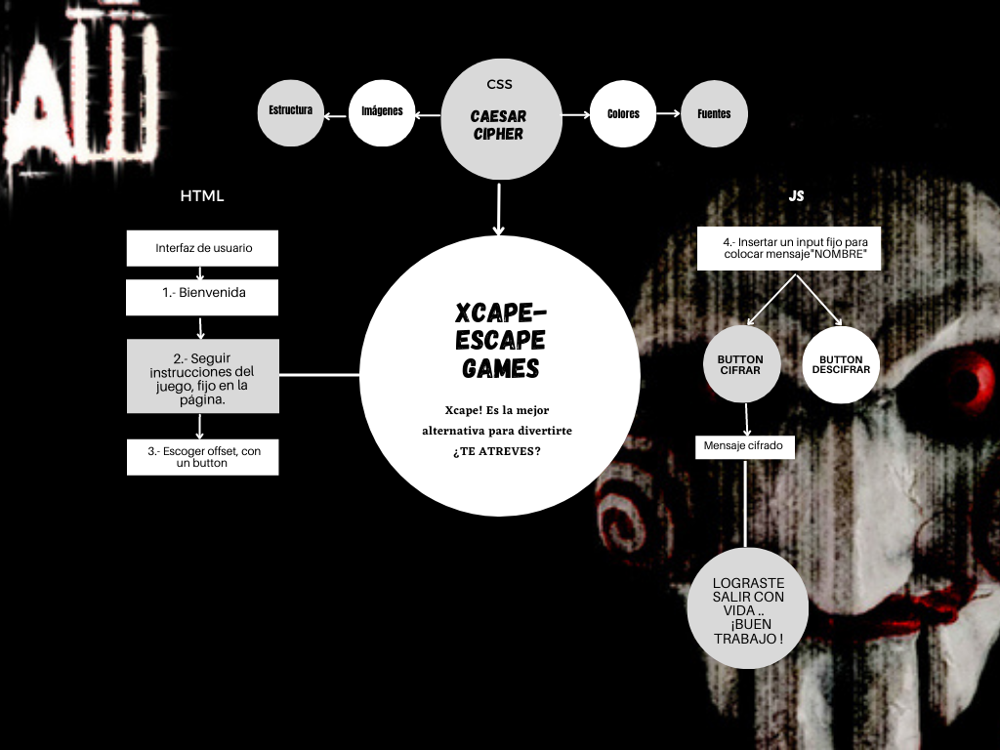
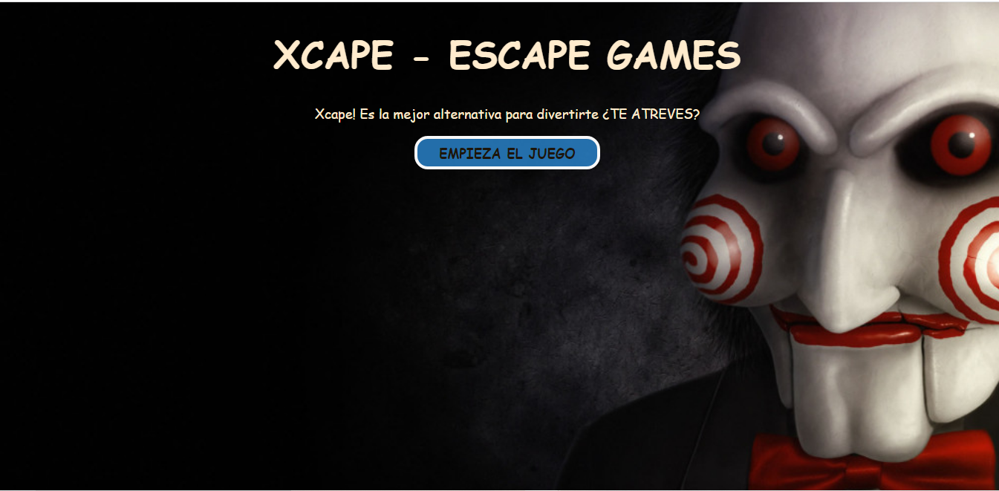
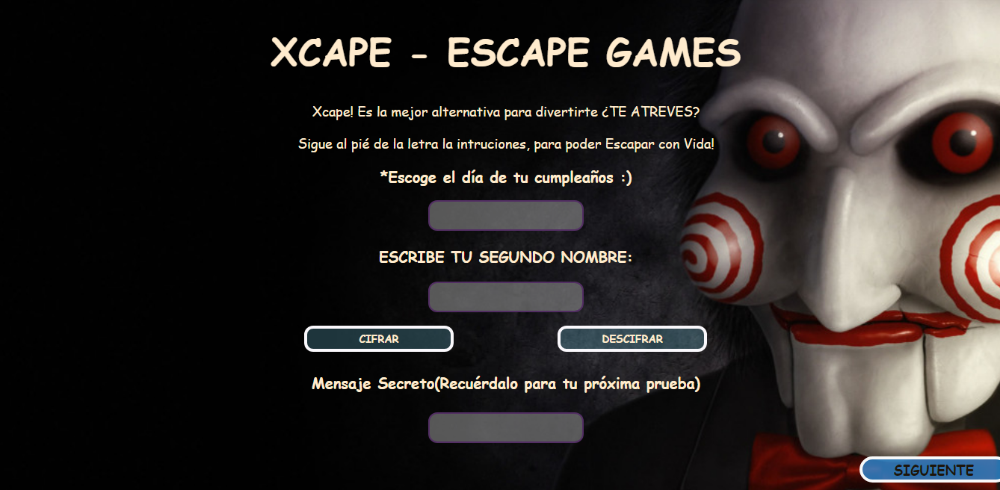
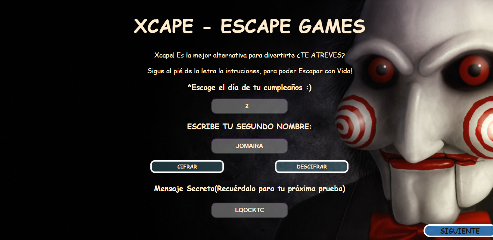
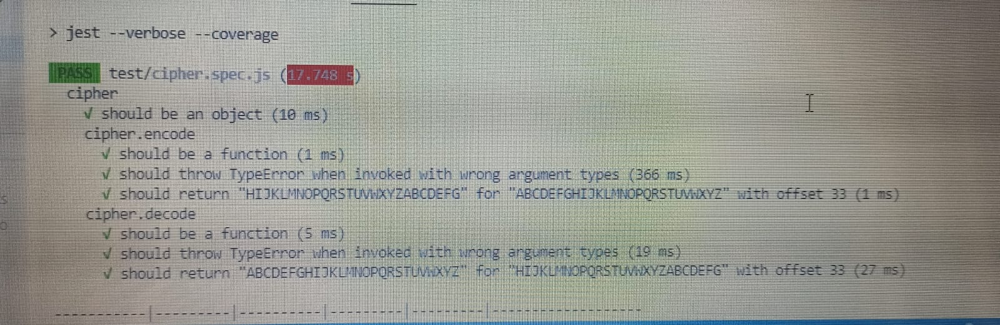
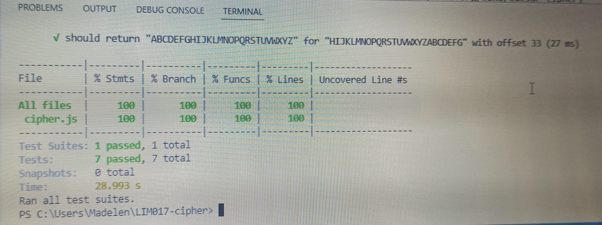

# Cifrado César

## Índice

* [1. Preámbulo](#1-preámbulo)
* [2. Resumen del proyecto](#2-resumen-del-proyecto)
* [3. Objetivos de aprendizaje](#3-objetivos-de-aprendizaje)
* [4. Definición del Producto](#4-definición-del-producto)
* [5. Consideraciones técnicas](#5-consideraciones-técnicas)

***

## 1. Preámbulo

Cifrar significa codificar. El [cifrado César](https://en.wikipedia.org/wiki/Caesar_cipher)
es uno de los primeros métodos de cifrado conocidos. El emperador romano Julio
César lo usaba para enviar órdenes secretas a sus generales en los campos de
batalla.

El cifrado césar es una de las técnicas más simples para cifrar un mensaje. Es
un tipo de cifrado por sustitución, es decir que cada letra del texto original
es reemplazada por otra que se encuentra un número fijo de posiciones
(desplazamiento) más adelante en el mismo alfabeto.

Por ejemplo, si usamos un desplazamiento (_offset_) de 3 posiciones:

* La letra A se cifra como D.
* La palabra CASA se cifra como FDVD.
* Alfabeto sin cifrar: A B C D E F G H I J K L M N O P Q R S T U V W X Y Z
* Alfabeto cifrado: D E F G H I J K L M N O P Q R S T U V W X Y Z A B C

En la actualidad, todos los cifrados de sustitución simple se descifran con
mucha facilidad y, aunque en la práctica no ofrecen mucha seguridad en la
comunicación por sí mismos; el cifrado César sí puede formar parte de sistemas
más complejos de codificación, como el cifrado Vigenère, e incluso tiene
aplicación en el sistema ROT13.

## 2. Resumen del proyecto

El proyecto se crea en base a una aplicación web que servirá al usuario para cifrar y decifrar el texto ingresado por el mismo  indicando un desplazamiento específico de caracteres (_offset_).

La temática que fue escogida es de juegos de escape la página la llamé X-CAPE GAMES ;  el usuario debera segir las instrucciones del juego para poder salir con vida, esta plataforma puede ser usada de manera virtual o presencial, ya que la temática permite dar un plus al jugador en el que tendrá que resolver una serie de acertijos.
El primer juego se trata de utilizar el mensaje para pasar a la siguiente sala, por lo que el cifrado será de vital importancia, porque cada jugador tendrá su código unico e intrasferible.

## 3. Objetivos de aprendizaje

Los objetivos de aprendizaje que se utilizaron son muchos de los temas  proporcionados en el proyecto, como ayudas detallados a continuación:

#### HTML
#### CSS
#### Web APIs
#### JavaScript
#### Control de Versiones (Git y GitHub)
#### User-Centricity
## 4. Definición del producto
#### Product-Design

- [ ] **Prototipo de alta fidelidad que incluyan interacciones**
El prototipo fue elaborado en canva, el mismo fue pensado previamente en lo que se queria logra en la pagina, con la adicion de bototones en input , que  brindarían al usuario más comodidad a la hora de ingresar a la plataforma.

- [ ] **Seguir los principios básicos de diseño visual**

El diseño que se escogió para el proyecto, es muy facil de usar para el usuario, en el que sin problema podra segir las instrucciones del mismo para que pueda seguir avanzando, y de esta manera concluya de manera exitosa.

#### Quiénes son los principales usuarios del producto.

- El producto esta diseñado básicamente para, adolescente y adultos que desean encontrar una forma de divertirte totalmente distinta y fuera de lo habitual.
- Si creías que ya lo habías probado todo, te equivocaste aquí encontraras una manera de divertirte totalmente distinta, fuera de lo habitual.

#### Cuáles son los objetivos de estos usuarios en relación con tu producto

- Es una aventura en donde  te conviertes en el héroe, en diferentes temáticas tendrás que resolver acertijos, enigmas, y escapar en el menor tiempo posible.
- Tendrán que estar muy muy atentos y seguir las instrucciones ya que pueden ser la pista que falta para conseguir el objetivo.
- ¿TE APUNTAS AL JUEGO?

#### Cómo cree que el producto que está creando está resolviendo sus problemas.

- El cifrado César, también conocido como cifrado por desplazamiento, código de César o desplazamiento de César, es una de las técnicas de cifrado más simples y más usadas. Es un tipo de cifrado por sustitución en el que una letra en el texto original es reemplazada por otra letra que se encuentra un número fijo de posiciones más adelante en el alfabeto.
- El programa está encaminado a descifrar ciertos códigos, traducidos a la actualidad pueden ser utilizados en algunos aspectos, sean de manera secreta como en una zona de conflicto, cartas de amor o directamente para el ocio, como es el caso que se esta presentando.

### Interfaz de usuario (UI)

La interfaz debe permitir al usuario:

* Elegir un desplazamiento (_offset_) indicando cuántas posiciones queremos que
  el cifrado desplace cada caracter.
  

  
* Insertar un mensaje (texto) que queremos cifrar.

* Ver el resultado del mensaje cifrado.
* Insertar un mensaje (texto) a descifrar.

* Ver el resultado del mensaje descifrado.

## 5. Consideraciones técnicas

Para las consideraciones técnicas permitidas en el proyecto, se consideró el porcentje permitido con un mínimo del 70% de _statements_ ,_functions_y _lines_, y un mínimo de 50% de _branches_.

***

